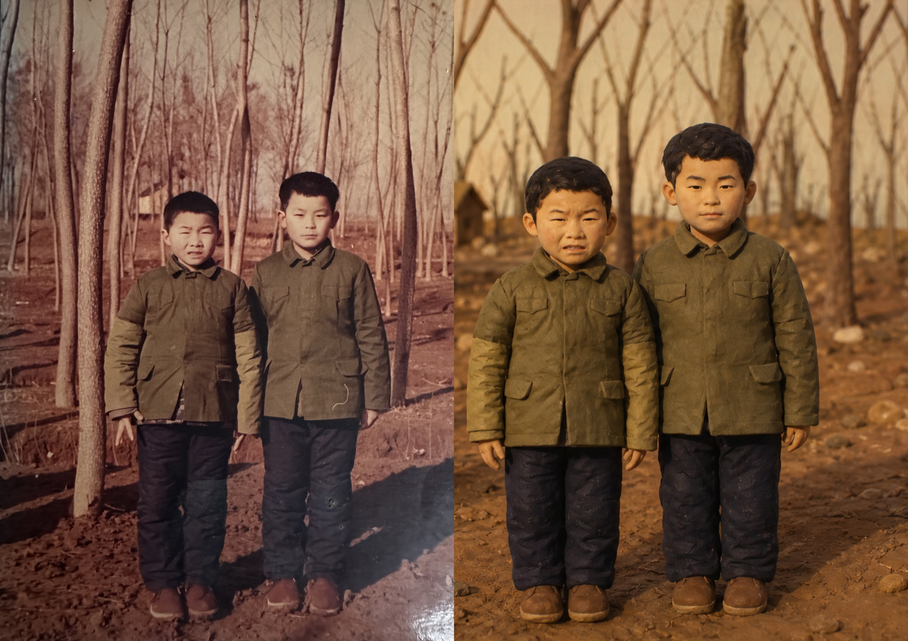
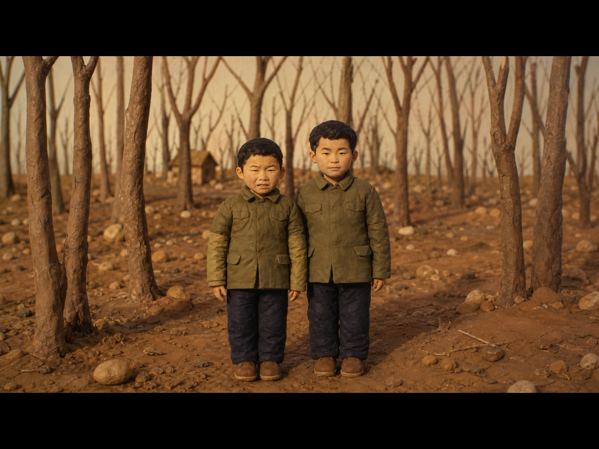

# Photo To Claymation Shot

Turn a portrait photo into an Aardman-style claymation cinematic still, with a repeatable Codex workflow for photo analysis, prompt design, image generation, and final comparison packaging.

This is not a simple "make it clay" prompt. The skill first extracts the person's recognizable visual cues, then rebuilds the subject as a handmade stop-motion character in a miniature film world. It is useful when the result needs to feel directed, warm, cinematic, and still traceable to the original person.





## Why Star This

- Preserves recognition cues instead of producing a generic clay character.
- Uses the S/W/I/F/T/P/M framework to turn visual observation into a controllable image prompt.
- Delivers both a before/after comparison and a movie-spec cinematic frame from the same 16:9 generated shot.
- Includes deterministic helper scripts for comparison layout and 4:3 matte framing.
- Works well for family portraits, character references, avatar concepts, and warm social-media image transformations.

## When To Use

Use this skill when you have a portrait, character photo, or people-focused image and want:

- Aardman-style claymation character transformation.
- Stop-motion film stills with miniature-set atmosphere.
- A before/after image that clearly shows the transformation.
- A clean cinematic still with black bars for presentation.
- A reusable prompt-writing workflow for batch portrait transformations.

## Example Outputs

The `examples/` folder contains real outputs produced with this workflow:

- `examples/claymation-comparison.png`: original-plus-result comparison.
- `examples/claymation-cinematic-frame.png`: 4:3 delivery frame with a 16:9 active movie picture.

User source photos are not included in the skill package. The examples are only there to show the visual target and packaging style.

## How To Invoke

```text
$photo-to-claymation-shot
Turn this portrait into a claymation cinematic still. Preserve the person's hairstyle, expression, clothing, and posture. Deliver both the comparison image and the cinematic matte frame.
```

```text
$photo-to-claymation-shot
Use this old family photo as the source. Keep the winter mood and rebuild it as a handcrafted stop-motion movie frame.
```

```text
$photo-to-claymation-shot
Write only the S/W/I/F/T/P/M prompt for this portrait. Do not generate the image yet.
```

## What It Produces

- Photo analysis using the S/W/I/F/T/P/M framework.
- A final image-generation prompt with subject, world, intention, form, time, perception, and medium constraints.
- One true 16:9 claymation cinematic shot as the source image.
- A comparison image derived from that same shot.
- A 4:3 cinematic matte frame with a 16:9 active picture.

## Install

Copy this folder into your Codex skills directory:

```bash
mkdir -p ~/.codex/skills
cp -R photo-to-claymation-shot ~/.codex/skills/
```

Then invoke it in Codex with `$photo-to-claymation-shot`.

## Repository Structure

- `SKILL.md`: main workflow, guardrails, output contract, and delivery rules.
- `references/swiftpm-framework.md`: S/W/I/F/T/P/M visual breakdown system.
- `references/claymation-style-rules.md`: claymation style constraints.
- `references/cinematic-shot-design.md`: 16:9 cinematic shot direction.
- `scripts/compose_comparison.py`: deterministic before/after composition helper.
- `scripts/create_cinematic_frame.py`: deterministic matte-frame helper.
- `examples/`: representative outputs from prior runs.
- `agents/openai.yaml`: Codex UI metadata.

## Customization Ideas

Fork this skill if you want to adapt it for:

- Another stop-motion style, such as paper cutout, wool felt, puppet animation, or toy photography.
- A stricter brand character pipeline for avatars or mascots.
- Batch prompt generation for many portraits.
- A different final packaging format, such as square social posts, vertical covers, or storyboard panels.

The most important files to customize are `SKILL.md` and the style references under `references/`.

## Notes

This skill is for creative transformation and visual packaging. Keep private user photos and generated task artifacts outside the skill folder unless you intentionally add sanitized examples.
